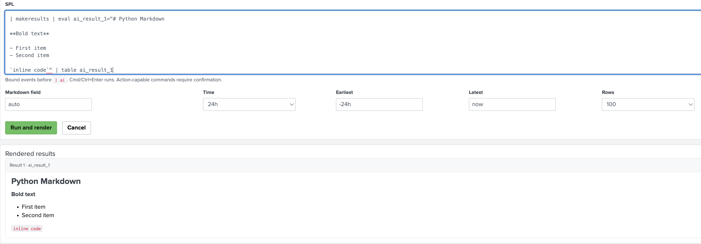

# spl_ai_markdown

A private Splunk Enterprise app for running bounded SPL and rendering AI-generated Markdown as sanitized HTML.



## What it does

- Provides a multiline, Search & Reporting-style SPL editor.
- Runs searches as the signed-in Splunk user with explicit time bounds.
- Accepts `ai_result_1`, `ai_results_1`, or a validated explicit field.
- Converts Markdown server-side with Python-Markdown 3.9.
- Sanitizes HTML server-side with Bleach 6.2.0.
- Sanitizes again in the browser with DOMPurify 3.4.14 before rich rendering.
- Supports headings, emphasis, lists, fenced code, tables, blockquotes, rules, and links.
- Requires confirmation for action-capable commands such as `collect`, `delete`, `outputlookup`, and `sendalert`.

## Security boundaries

The SPL editor is intentionally an execution surface. Searches run with the current user's Splunk capabilities, quotas, and command restrictions. Do not paste untrusted SPL. Bound events before `| ai`; the browser row cap does not reduce upstream model requests.

Images, scripts, styles, forms, embedded media, SVG, MathML, event handlers, and unsafe protocols are removed. Model-generated links remain untrusted and should be reviewed before opening.

## Compatibility

Validated on Splunk Enterprise **10.4.1**, build `5a009d941268`, using Splunk's Python **3.13.11** runtime. See [prerequisites](docs/prerequisites.md).

## Build and test

```bash
python3 -m unittest tools.ai_markdown_python.test_core tools.ai_markdown_python.test_command -v
node tools/ai_markdown_python/test_ui.js
python3 tools/ai_markdown_python/verify_and_package.py
```

The verifier performs identity/XML/conf checks, Python and browser sanitizer contracts, secret/raw-event scans, deterministic double builds, and archive-member validation.

## Installation

Install the generated `apps/_packages/spl_ai_markdown_python-<version>.tgz` on the Splunk search tier, ensure ownership is `splunk:splunk`, and restart Splunk when registering the custom command for the first time. The app route is:

```text
/en-US/app/spl_ai_markdown_python/markdown_python
```

## Repository layout

- `apps/spl_ai_markdown_python/` — installable Splunk app source
- `tools/ai_markdown_python/` — tests and deterministic package verifier
- `docs/` — prerequisites, security notes, and sanitized screenshots

**Author:** G0TH3R
